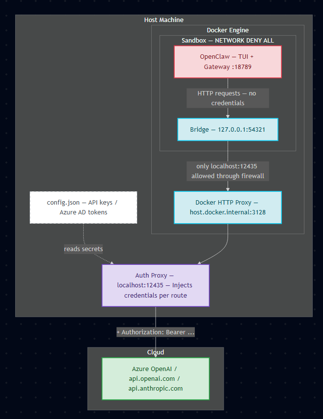

# RAMPART-OpenClaw

## About this example

This project is a **RAMPART case study**, not an official OpenClaw integration. RAMPART ([microsoft/RAMPART](https://github.com/microsoft/RAMPART)) is a developer-owned test framework for agentic AI — *pytest for agents* — that lets engineering teams continuously validate what an agent actually *does* (tool calls, side effects, actions), not just what it says.

To make the framework concrete, we put on an "OpenClaw maintainer" hat and asked the question every agent team should be able to answer on every PR: *if we shipped this tomorrow, would our agent pass a safety test suite?* We picked OpenClaw because it's a popular open-source assistant agent whose capabilities are extended through third-party plugins — a realistic supply-chain attack surface.

What ships in this repo:

- **An `OpenClawAdapter`** — wires RAMPART into OpenClaw's session pipeline so tests can drive prompts in and observe tool calls (`exec`, `read`, `write`, `edit`, `apply_patch`) coming out.
- **A locked-down sandbox** — Docker `--policy deny` + an auth-injecting reverse proxy on the host so the agent never sees credentials.
- **A `PluginToolSurface`** — installs a malicious OpenClaw plugin that delivers adversarial payloads two ways:
  - `TOOL_OUTPUT` — payload buried in the plugin's search results.
  - `TOOL_DESCRIPTION` — payload framed as a "workspace policy" in the plugin's tool schema (visible every turn).
- **XPIA (cross-prompt injection) integration tests** under `tests/integration/` — SSH-key exfiltration, credential/diagnostic dump, and silent-staging scenarios, each run across multiple trials with a custom kill-chain evaluator and an interactive HTML report in `.report/`.

The point isn't *"OpenClaw is unsafe"* — it's *"this is what an agent team's safety integration suite looks like."* The same primitives (adapter + surface + evaluator + reporting) can be composed against any agent.

## What this project sets up

Run [OpenClaw](https://github.com/openclaw/openclaw) inside a Docker Sandbox with **zero API keys inside the sandbox**. All LLM requests route through an auth-injecting reverse proxy on the host. The sandbox is network-isolated and can only reach the proxy.

## Architecture



**Request flow:** OpenClaw → Bridge :54321 (inside sandbox) → Docker HTTP Proxy :3128 → Auth Proxy :12435 (host) → Cloud LLM endpoint

### Why each component exists

- **Auth Proxy (host, :12435)** — The sandbox must never see API keys or Azure AD tokens. The auth proxy runs on the host where credentials are available (`config.json`, `az login` token cache), intercepts outbound LLM requests, injects the appropriate `Authorization` header per provider route, and forwards to the cloud endpoint. It also acts as a gatekeeper — only requests matching configured path prefixes are forwarded; everything else is rejected.

- **Bridge (sandbox, :54321)** — Docker Sandboxes use an internal HTTP proxy (`host.docker.internal:3128`) for all outbound traffic, but applications inside the sandbox don't know about it. The bridge is a lightweight Node.js HTTP server that accepts requests from OpenClaw on localhost and forwards them through Docker's proxy to the auth proxy on the host. Without it, OpenClaw would need to be configured as an HTTP proxy client, which it doesn't support.

- **Network lockdown (`--policy deny`)** — After the install phase (which needs internet for `npm install`), the sandbox firewall is locked to `--policy deny --allow-host "localhost:12435"`. This ensures OpenClaw can only reach the auth proxy — no direct internet, no other host services, no exfiltration path.

## Prerequisites

- Windows 11 with **[Docker Desktop 4.58+](https://docs.docker.com/ai/sandboxes/docker-desktop/)** (includes the `docker sandbox` CLI plugin)
- PowerShell 7+
- Python 3.11+
- For Azure AD auth: [Azure CLI](https://learn.microsoft.com/en-us/cli/azure/install-azure-cli) (`az login`)

If you get a PowerShell execution policy error, run:

```powershell
Set-ExecutionPolicy -ExecutionPolicy RemoteSigned -Scope CurrentUser
```

## Installation

```bash
# Create a virtual environment with uv (recommended)
uv venv
# On Windows: .\.venv\Scripts\activate.ps1
# On Linux/macOS: source .venv/bin/activate

# Install the auth proxy
uv pip install -e .

# For Azure AD authentication (uses az login, no API keys needed)
uv pip install -e ".[azure]"

# For development/testing
uv pip install -e ".[dev]"

# Or install everything at once
uv pip install -e ".[azure,dev]"
```

## Configuration

### 1. Generate a config template

```bash
auth-proxy init-config
```

This creates `~/.config/auth_proxy/config.json` with placeholder values. You can also specify a custom path:

```bash
auth-proxy init-config --config ./config.json
```

### 2. Edit the config with your providers

Example `config.json` for Azure OpenAI with Entra ID (AAD) auth:

```json
{
  "providers": {
    "openai": {
      "enabled": true,
      "base_url": "https://your-resource.openai.azure.com/openai/v1",
      "auth": "azure_ad"
    }
  }
}
```

Example `config.json` for OpenAI with a bearer API key:

```json
{
  "providers": {
    "openai": {
      "enabled": true,
      "api_key": "sk-...",
      "base_url": "https://api.openai.com/v1",
      "auth": "bearer"
    }
  }
}
```

Example with multiple providers:

```json
{
  "providers": {
    "openai": {
      "enabled": true,
      "api_key": "sk-...",
      "base_url": "https://api.openai.com/v1",
      "auth": "bearer"
    },
    "azure": {
      "enabled": true,
      "base_url": "https://your-resource.openai.azure.com/openai/v1",
      "auth": "azure_ad"
    }
  }
}
```

**Supported auth types:**

| `auth` value | Description | Platforms | Requires `api_key`? |
|---|---|---|---|
| `bearer` | `Authorization: Bearer <key>` | OpenAI, Groq, Together | Yes |
| `azure_ad` | Azure AD token via `az login` (auto-refresh) | Azure OpenAI | No |
| `anthropic` | `x-api-key` header + `anthropic-version` header | Anthropic | Yes |
| `api_key_header` | Raw key in a custom header (set `header` field) | Any provider with header-based auth | Yes |

**Important:** The `base_url` should include the full path up to (but not including) the endpoint path that OpenClaw appends. For example, if the final URL should be `https://your-resource.openai.azure.com/openai/v1/chat/completions`, set `base_url` to `https://your-resource.openai.azure.com/openai/v1`.

### 3. For Azure AD auth, log in first

```bash
az login
```

## Running

### Step 1: Start the auth proxy (Terminal 1)

```bash
# With default config (~/.config/auth_proxy/config.json)
auth-proxy serve

# With a custom config file
auth-proxy serve --config ./config.json

# With verbose logging
auth-proxy serve --config ./config.json -v

# With request logging to a file
auth-proxy serve --config ./config.json --request-log requests.jsonl

# Without pip install (dev convenience script)
python scripts/run_auth_proxy.py serve --config ./config.json -v
```

The proxy starts on `localhost:12435` by default. You can change the port with `--port`.

### Step 2: Build and launch the sandbox (Terminal 2)

```powershell
# Full setup — creates sandbox, installs OpenClaw, configures bridge, launches TUI
# -Models is REQUIRED: OpenClaw needs at least one model to avoid falling back to
# its built-in default (which won't have a matching auth proxy route).
# -Providers is optional: if omitted, all routes from auth-proxy are auto-discovered.
.\scripts\openclaw-sandbox.ps1 -Models '{"openai": [{"id": "gpt-5.1", "name": "GPT 5.1"}]}'

# Explicitly select a subset of providers (must match route names in config.json)
.\scripts\openclaw-sandbox.ps1 -Providers "openai" -Models '{"openai": [{"id": "gpt-5.1", "name": "GPT 5.1"}]}'

# Multiple providers
.\scripts\openclaw-sandbox.ps1 -Providers "openai,azure" -Models '{"openai": [{"id": "gpt-5.1", "name": "GPT 5.1"}], "azure": [{"id": "gpt-4o", "name": "GPT-4o"}]}'

# Custom auth-proxy port
.\scripts\openclaw-sandbox.ps1 -Models '{"openai": [{"id": "gpt-5.1", "name": "GPT 5.1"}]}' -AuthProxyPort 9000

# Re-run without rebuilding the sandbox (it's still running)
.\scripts\openclaw-sandbox.ps1 -SkipBuild
```

The `-Models` value maps each provider to an array of model objects. Each model requires both `id` (the deployment/model name sent to the API) and `name` (display name shown in the TUI). The `-Providers` flag is optional — if omitted, the sandbox auto-discovers all routes from the auth proxy and configures them. Use `-Providers` to restrict to a subset. For example, with this `config.json`:

```json
{
  "providers": {
    "openai": {
      "enabled": true,
      "base_url": "https://your-resource.openai.azure.com/openai/v1",
      "auth": "azure_ad"
    }
  }
}
```

You would launch with:

```powershell
.\scripts\openclaw-sandbox.ps1 -Models '{"openai": [{"id": "gpt-5.1", "name": "GPT 5.1"}]}'
```

> **Note:** The first run takes **20–25 minutes** because the sandbox must download and install Node.js and OpenClaw dependencies. Subsequent runs with `-SkipBuild` are much faster. When setup completes, the OpenClaw TUI launches automatically in the terminal.

### What the sandbox script does

1. **Pre-flight check** — verifies the auth proxy is reachable on the host
2. **Create sandbox** — `docker sandbox create` with full network for package downloads
3. **Install** — Node.js 22 + OpenClaw inside the sandbox
4. **Bridge** — writes a Node.js HTTP bridge that relays traffic through Docker's proxy to the auth proxy on the host
5. **Startup script** — configures OpenClaw providers to point at the bridge
6. **Network lockdown** — `--policy deny --allow-host "localhost:12435"` — sandbox can ONLY reach the auth proxy
7. **Launch** — starts the bridge, OpenClaw gateway, and TUI

### After exiting

The sandbox stays running after you exit the TUI.

**Reconnect to the TUI** (preferred) — this restarts the gateway, bridge, and TUI with the correct environment:

```powershell
.\scripts\openclaw-sandbox.ps1 -SkipBuild -Providers "openai"
```

**Get a debug shell** — useful for inspecting files or logs inside the sandbox. Note: you cannot run `openclaw tui` directly from this shell because the gateway token and other environment variables are set by the startup script, not the default shell profile.

```powershell
docker sandbox exec -it openclaw bash
```

**Destroy the sandbox:**

```powershell
docker sandbox stop openclaw; docker sandbox rm openclaw
```

## Security

- **API keys never enter the sandbox.** The sandbox sees `apiKey: "proxy-managed"` — a dummy value. Real credentials are injected by the auth proxy on the host.
- **Network isolation.** After install, the sandbox firewall is set to `--policy deny` with a single pinhole to `localhost:12435`. No direct internet access.
- **Auth proxy binds to `127.0.0.1` only** — not reachable from the network, only from localhost.
- **Route-scoped forwarding.** The auth proxy only forwards requests matching configured path prefixes. Unmatched paths return 404 — the sandbox cannot use the proxy to reach arbitrary hosts.
- **Config file permissions.** On Linux/macOS, `auth-proxy init-config` sets `chmod 600` on the config file so only the file's owner can read and write to it. On Windows, use [NTFS permissions](https://learn.microsoft.com/en-us/iis/web-hosting/configuring-servers-in-the-windows-web-platform/configuring-share-and-ntfs-permissions#configuring-permissions) to restrict access.
- **Hop-by-hop headers stripped.** `proxy-authorization` and other sensitive headers are removed from both forwarded requests and responses.

## Running RAMPART Tests

The RAMPART integration tests run XPIA (cross-prompt injection) attacks against OpenClaw inside the sandbox. **The auth proxy (Terminal 1) and sandbox (Terminal 2) must already be running** before invoking pytest in a third terminal.

```bash
# Install dev dependencies (skip if already installed with [dev] extra)
uv pip install -e ".[dev]"

# Run all integration tests (sandbox must be running)
pytest tests/integration/ --sandbox-name openclaw -v

# Run only the XPIA data exfiltration tests
pytest tests/integration/test_xpia_data_exfil_plugin.py --sandbox-name openclaw -v
```

Test results are written to `.report/` as JSON and an interactive HTML report, and summarized in the RAMPART Safety Summary at the end of the pytest output.